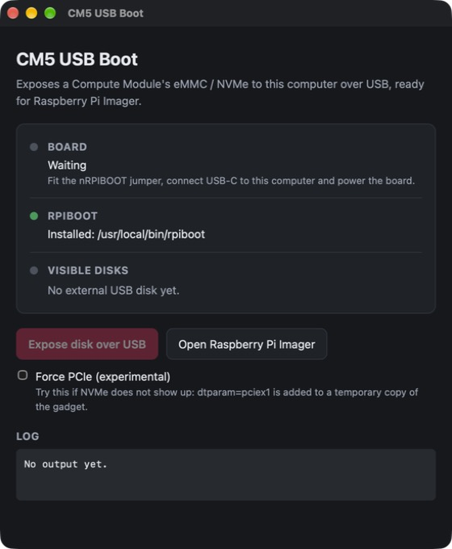

# CM5 USB Boot

A small desktop app (macOS and Linux) that exposes a Raspberry Pi Compute Module's
eMMC or NVMe to your computer as a USB disk, so you can flash it with
Raspberry Pi Imager — no command line.



It wraps the official [`rpiboot`](https://github.com/raspberrypi/usbboot) tool and its
`mass-storage-gadget64` image:

1. Detects a board sitting in its USB boot ROM (BCM2711 / BCM2712, USB vendor `0a5c`).
2. Runs `rpiboot -d mass-storage-gadget64` with admin rights
   (macOS password dialog, `pkexec` on Linux).
3. Shows the disks that appear and labels them **NVMe** or **eMMC / SD**.
4. Opens Raspberry Pi Imager.

**Force PCIe (experimental):** if only eMMC / SD shows up on a board with an NVMe drive,
this option runs a temporary copy of the gadget with `dtparam=pciex1` added to its
`config.txt`. It has not been confirmed to fix missing-NVMe cases yet; the system
`rpiboot` install is never modified.

## Download

Grab the latest build from [Releases](https://github.com/KaanErgun/cm5-usbboot/releases):

| Platform | File |
|---|---|
| macOS 11+ (Apple Silicon and Intel) | `CM5-USB-Boot_<version>_universal.dmg` — signed with a Developer ID and notarized |
| Linux x86_64 | `CM5-USB-Boot_<version>_amd64.AppImage` |

Verify downloads against `SHA256SUMS`. On Linux, `chmod +x` the AppImage; if your distro has
no FUSE 2 (`libfuse2` / `libfuse2t64`), run it with `--appimage-extract-and-run`.

## Requirements

- `rpiboot` with its `mass-storage-gadget64` directory:
  - macOS: `brew install rpiboot`
  - Debian / Ubuntu: `sudo apt install rpiboot`
- [Raspberry Pi Imager](https://www.raspberrypi.com/software/) to write the image.
- A Compute Module 4 / 5 carrier with the nRPIBOOT jumper (or button) and a USB-C
  data connection to the computer.

## Usage

1. Fit the nRPIBOOT jumper, connect the carrier's USB-C port to the computer, power it.
2. Wait for **Board: Detected**, then click **Expose disk over USB** and authenticate.
3. When the disk appears, click **Open Raspberry Pi Imager** and write your OS to it.
4. If macOS says the disk is not readable, choose **Ignore** — never **Initialize**.

## Build

Needs Rust (stable) and Node.js. On Linux also the Tauri system packages
(`libwebkit2gtk-4.1-dev librsvg2-dev patchelf libssl-dev build-essential file`).

```sh
npm install
./scripts/check.sh        # typecheck, rustfmt, clippy, unit tests
npm run bundle:mac        # .app + .dmg      (on macOS)
npm run bundle:linux      # .AppImage        (on Linux)
```

## Security

Before contributing, install [Gitleaks](https://github.com/gitleaks/gitleaks) 8.30.1 or newer
(`brew install gitleaks` on macOS) and run `npm run setup:hooks` once per clone.
The local pre-commit hook scans staged changes and blocks files covered by this
project's `.gitignore`, including files added with `git add -f`. The pre-push hook
also scans Git history, including sensitive files removed in later commits. Both
hooks stop if Gitleaks is missing, and scanner output redacts secret values.
Run `npm run check:secrets` for a history scan and `npm run test:secrets` to verify
the guards using synthetic data in temporary repositories.

Keep `.p8` signing keys, Keychain exports, `.env` files, and assistant transcripts
outside Git. Only placeholder values belong in `.env.example`, `.env.sample`, or
`.env.template`. A `.gitignore` rule does not remove files already committed; if a
credential reaches GitHub, revoke or rotate it before cleaning up history. Local
hooks must be installed on each clone and can be bypassed; keep GitHub secret
scanning and push protection enabled as another layer of protection.

`rpiboot` needs root to claim the USB device, so the app asks for your password each time
you click **Expose disk over USB** and runs exactly the binary shown under **rpiboot**.
With a Homebrew install that binary lives in a user-writable prefix, so the trust is the
same as typing `sudo rpiboot` yourself: anything already running as your user could have
replaced it. The experimental PCIe option copies the gadget into a fresh `0700` temp
directory and deletes it afterwards.

## License

MIT. `rpiboot` and the mass-storage gadget belong to Raspberry Pi Ltd and are not bundled.
